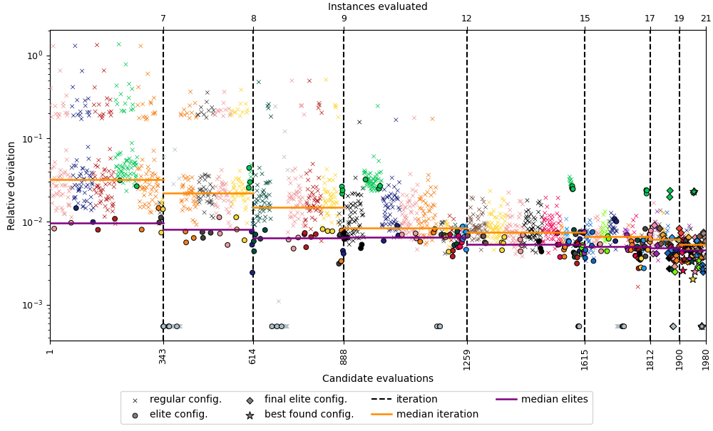
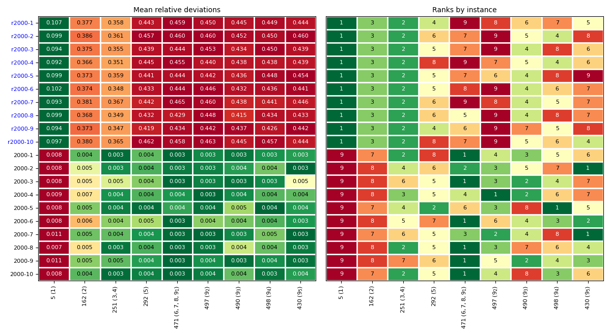

# acviz: Algorithm Configuration Visualizations for irace

This Python program provides visualizations of the automatic algorithm configuration process with [irace](http://iridia.ulb.ac.be/irace). The *acviz* program is described in the following paper.

> **ACVIZ: Algorithm Configuration Visualizations for irace**<br>
> Marcelo de Souza, Marcus Ritt, Manuel López-Ibáñez, Leslie Pérez Cáceres<br>
> Submitted to Optimization Letters, 2020<br>
> Supplementary material available [here](https://doi.org/10.5281/zenodo.4028906).

**Bibtex**

```
@article{SouzaEtAl2020acviz,
   title   = {ACVIZ: Algorithm Configuration Visualizations for irace},
   author  = {Souza, Marcelo and Ritt, Marcus and L{\'o}pez-Ib{\'a}{\~n}ez, Manuel and {P{\'e}rez C{\'a}ceres}, Leslie},
   journal = {Submitted to Computers \& Operations Research},
   year    = {2020}
}
```

Please, make sure to reference us if you use *acviz* in your research.

## People

**Maintainer:** [Marcelo de Souza](https://souzamarcelo.github.io).

**Contributors:** [Marcus Ritt](https://www.inf.ufrgs.br/~mrpritt), [Manuel López-Ibáñez](http://lopez-ibanez.eu) and [Leslie Pérez Cáceres](https://sites.google.com/site/leslieperez).

**Contact:** marcelo.desouza@udesc.br

## Dependencies

The script requires [Python 3](https://www.python.org) and the following Python libraries:
+ [numpy](https://numpy.org)
+ [pandas](https://pandas.pydata.org)
+ [matplotlib](https://matplotlib.org)
+ [rpy2](https://rpy2.github.io)

Since irace exports the log file using the R syntax and format, you will need the [R software environment](https://www.r-project.org) installed (rpy2 module will communicate with R to get the necessary data).

## Usage

To use *acviz* you need to download the `acviz.py` script and run it according to the following instructions (make sure that the aforementioned dependencies were all satisfied). It is possible to control several elements of the visualization, including:
+ plot executions over configuration time;
+ disable the identification of instances and executions of elite configurations;
+ show the configurations associated with the best executions;
+ change the imputation strategy;
+ control the opacity of the points;
+ control the values and colors of the test plot;
+ export the produced plot.

**Input:** an irace log file (typically called irace.Rdata) and optional parameters to control the plot details and the output format.

**Output:** a matplotlib plot.

```
usage: acviz.py [-h] [--iracelog <file>] [-v] [--overtime] [--bkv <file>]
                [--noelites] [--pconfig <p>] [--noinstances]
                [--imputation <imp>] [--alpha <alpha>] [--testing]
                [--testcolors <col>] [--testresults <res>] [--exportdata]
                [--exportplot] [--output <name>]

required arguments:
  --iracelog <file>    input of irace log file (.Rdata)

optional arguments:
  -v, --version        show description and exit
  --overtime           plot the execution over the accumulated configuration time (disabled by default)
  --bkv <file>         file containing best known values for the instances used (null by default)
  --noelites           enables identification of elite configurations (disabled by default)
  --pconfig <p>        when --configurations, show configurations of the p% best executions [0, 100] (default: 0)
  --noinstances        enables identification of instances (disabled by default)
  --imputation <imp>   imputation strategy for computing medians [elite, alive] (default: elite)
  --alpha <alpha>      opacity of the points, the greater the more opaque [0, 1] (default: 1)
  --testing            plots the testing data instead of the configuration process (disabled by default)
  --testcolors <col>   option for how apply the colormap in the test plot [overall, instance] (default: instance)
  --testresults <res>  defines how the results should be presented in the test plot [rdev, adev, raw] (default: rdev)
  --exportdata         exports the used data to a csv format file (disabled by default)
  --exportplot         exports the resulting plot to png and pdf files (disabled by default)
  --output <name>      defines a name for the output files (default: export)
```

## Examples

The [examples](examples) directory contains some exemplary irace log files. To analyze the evolution of the configuration process, you can call *acviz* from the command line as follows:

```
python3 acviz.py --iracelog examples/acotsp-instances.Rdata --bkv examples/bkv.txt
```

In this case, *acviz* will present the plot with each execution performed in the configuration process and the corresponding relative deviations from the best known values (in log scale). The log file is provided using option `--iracelog` and the file containing the best known values of each instance is provided using option `--bkv`.



In a second example, we visualize the quality of the best found configurations on the test instances (assuming that the testing options were enabled when running irace). We include the `--testing` option in the command as follows:

```
python3 acviz.py --iracelog examples/acotsp-overtuning.Rdata --bkv examples/bkv.txt --testing
```

In this case, *acviz* will present a visualization of the results of evaluating the best found configurations (best elite of each iteration and all elites of the last iteration) on all test instances.


