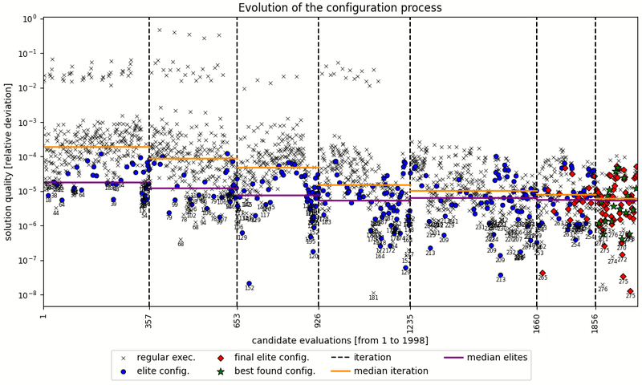

# cat: Configuration Analysis Tools for irace

This Python script provides a set of functions to analyze the automatic algorithm configuration process with [irace](http://iridia.ulb.ac.be/irace).

**Maintainer:** [Marcelo de Souza](https://souzamarcelo.github.io).

**Contributors:** [Marcus Ritt](https://www.inf.ufrgs.br/~mrpritt), [Manuel López-Ibáñez](http://lopez-ibanez.eu) and [Leslie Pérez Cáceres](https://sites.google.com/site/leslieperez).

If you have any difficult or want to collaborate with us, please write to me: marcelo.desouza@udesc.br.

## Dependencies

The script requires [Python 3.x](https://www.python.org) and the following Python modules (you can just install [anaconda](https://www.anaconda.com) to get Python with all modules included):

+ [numpy](https://numpy.org)
+ [pandas](https://pandas.pydata.org)
+ [matplotlib](https://matplotlib.org)
+ [rpy2](https://rpy2.github.io)

Since irace exports the log file using the R syntax and format, you will need the [R software environment](https://www.r-project.org) installed (rpy2 module will communicate with R to get the necessary data).

## Usage

To use **cat** you need to download the `cat.py` script and run it according to the following instructions (make sure that the aforementioned dependencies were all satisfied).

**Input:** an irace log file (typically called irace.Rdata) and optional parameters to control the plot details and the output format.

**Output:** a matplotlib graphic showing the candidate evaluations.

```
usage: cat.py [-h] --iracelog <file> [-v] [--objective <obj>] [--overtime]
              [--bkv <file>] [--elites] [--configurations] [--pconfig <p>]
              [--instances] [--exportdata] [--exportplot] [--output <name>]

required arguments:
  --iracelog <file>  input of irace log file (.Rdata)

optional arguments:
  -v, --version      show description and exit
  --objective <obj>  performance measure used by irace [cost or time]
                     (default: cost)
  --overtime         plot the execution over the accumulated configuration
                     time (disabled by default)
  --bkv <file>       file containing best known values for the instances used
                     (null by default)
  --elites           enables identification of elite configurations (disabled
                     by default)
  --configurations   enables identification of configurations (disabled by
                     default)
  --pconfig <p>      when --configurations, show configurations of the p% best
                     executions [0, 100] (default: 10)
  --instances        enables identification of instances (disabled by default)
  --exportdata       exports the used data to a csv format file (disabled by
                     default)
  --exportplot       exports the resulting plot to png and pdf files (disabled
                     by default)
  --output <name>    defines a name for the output files
```

### Optional arguments

+ `--objective`: specify how the performance of the target algorithm is measured (either by the best found *solution cost* or the *running time*).
+ `--overtime`: when enabled, the x-axis present the configuration time (available for irace executions with maxTime option).
+ `--bkv`: a file containing the best known values for the problem instances. It is used to calculate the cost relative deviation of each execution (then, it is used when the *objective is cost*). The file must present a pair *instance:value* per line.
+ `--elites`: enables the highlighting of the executions of elite configurations for each iteration, executions of final elite configurations, and executions of the best found configuration.
+ `--configurations`: enables the highlighting of configurations of the p% best performing executions of each iteration. Parameter p is given using the `--pconfig` argument (the defaulu value is 10).
+ `--instances`: enables the presentation of different instances used during the configuration process using colors.
+ `--exportdata`: exports the data used in csv format. The output will be saved in `./export/<name>.csv`, where `<name>` is defined using the `--output` argument.
+ `--exportplot`: exports the resulting plot in pdf and png formats. The output will be saved in `./export/<name>.pdf` and `./export/<name>.png`, where `<name>` is defined using the `--output` argument.
  + If no value for `--output` is provided, cat will use the name of the irace log file.


## Examples

The [examples](examples) directory has an irace log file example, which contains the log data of the ACOTSP algorithm configuration. To analyze it, you can call **cat** from the command line as follows:

```
python3 cat.py --iracelog examples/acotsp.Rdata --bkv examples/acotsp-bkv.txt --elites --instances
```

In this case, **cat** will present the corresponding plot with each execution performed in the configuration process and the obtained relative deviations from the best known solution (logscale). Elite, final elite, and the best found configurations are presented using different markers (since `--elites` is enabled) and each instance is present in a specific color (since `--instances` is enabled). For each iteration, the plot presents the median performances (overall and of the elite candidates). Observe that in the interactive mode, a tooltip box is presented when the cursor is over some point.


In a second example we disabled the instance highlighting (i.e. we removed the `--instances` option). In this case, executions of elite configurations are presented using different markers and colors. We can also enable the identification of configurations by using the argument `--configurations`. By setting `--pconfig 12`, **cat** will produce a plot with the 5% best executions of each iteration identified with the corresponding configuration identifier. The command is

```
python3 cat.py --iracelog examples/acotsp.Rdata --bkv examples/acotsp-bkv.txt --elites --configurations --pconfig 12
```

and the output is


